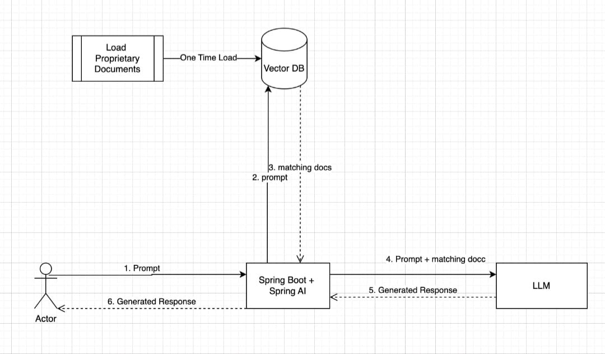

# Design Pattern Reference Assistant

An AI-powered assistant for retrieving and explaining software design patterns using **Spring AI**, **GPT-4**, **PostgreSQL (pgvector)**, and **GraalVM**.

## 🚀 Features
- **Retrieval-Augmented Generation (RAG)**: Enhances AI responses with relevant document retrieval.
- **Spring AI Integration**: Leverages GPT-4 for intelligent text generation.
- **Spring Shell**: Provides an interactive CLI for querying design patterns.
- **PostgreSQL + pgvector**: Efficient storage and retrieval of document embeddings.
- **GraalVM Native Image**: Optimized performance with reduced startup time.

## 🏗️ Architecture
1. **Document Ingestion**: Design pattern documentation is chunked and converted into embeddings.
2. **Storage**: Embeddings are stored in PostgreSQL with pgvector.
3. **Query Processing**:
    - User queries a design pattern.
    - The system retrieves relevant document chunks using vector search.
    - GPT-4 generates a refined response based on retrieved context.
4. **CLI Interaction**: Users can interact via a command-line interface using Spring Shell.



## 📦 Tech Stack
- **Spring Boot**
- **Spring AI**
- **Spring Shell**
- **PostgreSQL** + **pgvector**
- **GraalVM**

## ⚡ Quick Start

### 1️⃣ Clone the Repository
```sh
git clone https://github.com/AbdelilahSaouiri/RAG_SPRING_AI.git
```

### 2️⃣ Add Documents
Place your design pattern documentation files in the `resources/pdf/` directory.

### 4️⃣ Configure the Application
Modify `application.yml`:
```yaml
spring:
  datasource:
    url: jdbc:postgresql://localhost:5432/yourdb
    username: youruser
    password: yourpassword
  ai:
    openai:
      api-key: your-openai-api-key
      chat:
        options:
          model: gpt_model
```

### 5️⃣ Run the Application
```sh
./mvnw spring-boot:run
```
Or build and run a GraalVM native image:
```sh
./mvnw package -Pnative native:compile
./target/design-pattern-assistant
```

### 6️⃣ Using the CLI
Start the interactive assistant


